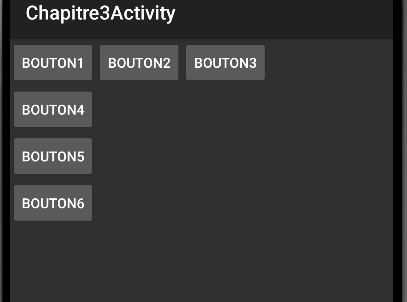
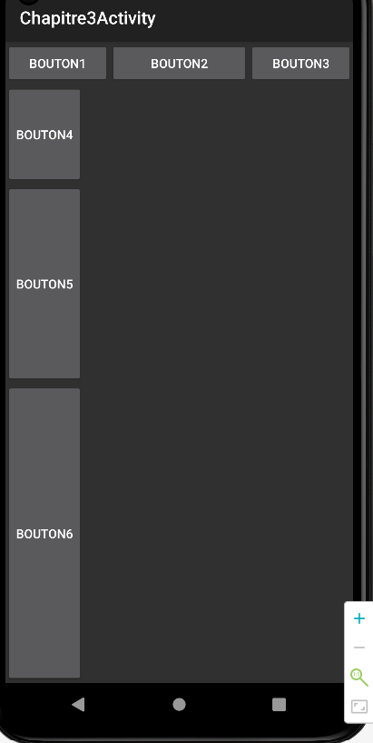
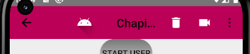

dimension dans les layouts  

dimension avec dp, sp et px  

Utilisation de linearLayout  

Utilisation des poids dans le linearLayout  

Exemple de mozaic  

Exemple de relativelayout sans margin  

Exemple de relativelayout avec margin sur btn2  

Exemple de relativelayout en étoile  

Exemple composant  

Exemple création de shpae pour arrondir bouton (drawable/roundbutton.xml)  

Exemple création d'une toolBar custom  
  
